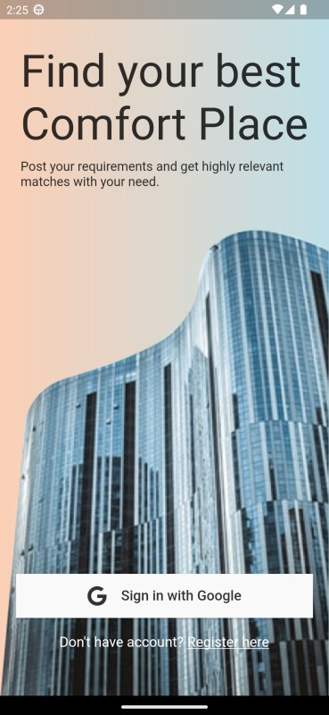
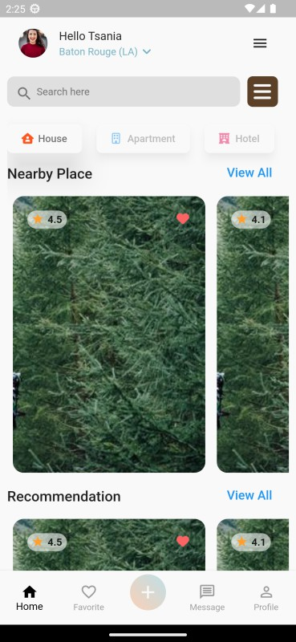
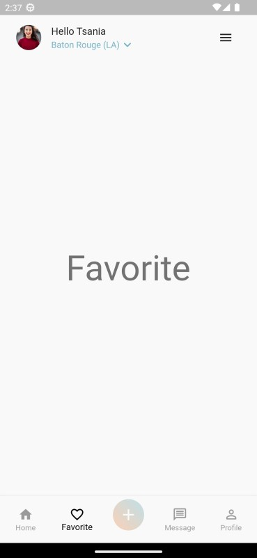
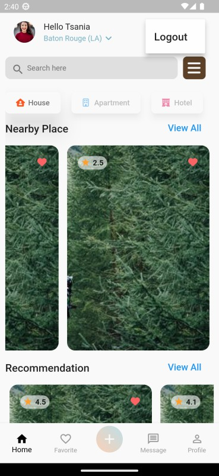

# Comfort Place 🏪
A comfort place finder app.

><b>Platforms:</b> Android, iOS, Web <b>Language/SDK:</b> Dart, Flutter

## **🎈 Screenshots**
&emsp;
&emsp;
&emsp;
 

## **🎈 Features**
- Landing page with functional sign-in button.
- User page with functional sign-out button (at top right menu).
- Functional Bottom navigation buttons with additional 3 dummy page views.
- Product carousal slider with API data (Images, Ratings etc.).
- Used BounceScrollingPhysics in carousel slider and main list view.
- State Management: Provider
- Architecture: MVC+S

## **🎈 Remarks**

Click to collapse/fold.

* Packages: provider, cached_network_image, font_awesome_flutter.

